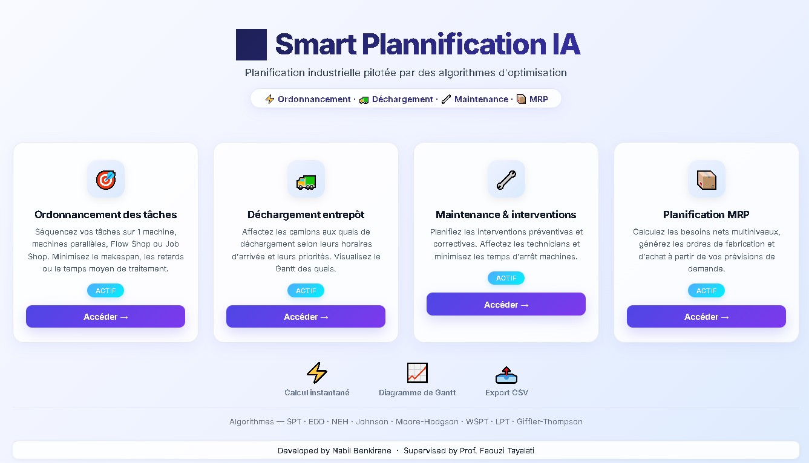
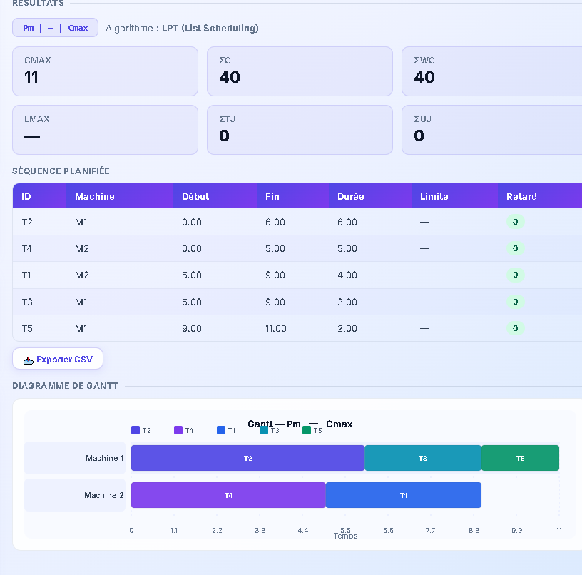
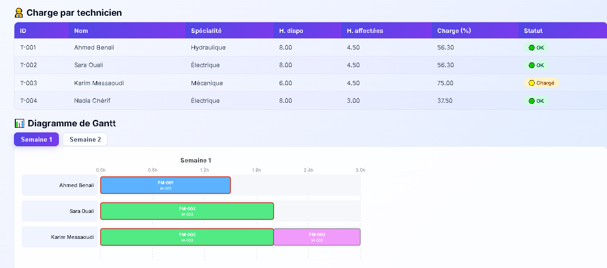

# 🚀 Smart Planning IA

Smart Planning IA is an Industry 4.0 web platform designed to optimize industrial planning and scheduling processes using advanced algorithms.

---

## 📸 Screenshots

### 🏠 Home Interface

### 📊 Gantt Chart Visualization

### 🔧 Maintenance Module

---

## ✨ Features

- Interactive Gantt charts
- Single Machine scheduling
- Parallel Machine scheduling
- Flow Shop scheduling
- Job Shop scheduling
- Maintenance planning
- Logistics optimization
- CSV export

---

## 🛠 Technologies

- HTML5
- CSS3
- JavaScript

---

## 👨‍💻 Author

**Nabil Benkirane**